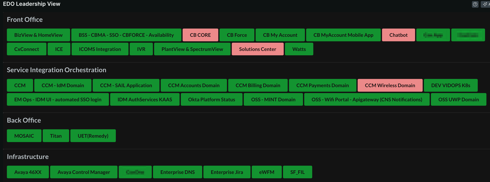
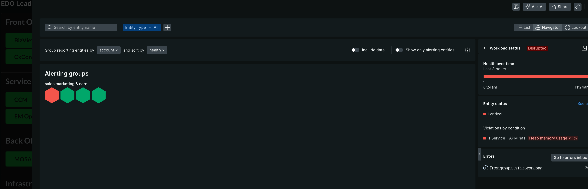

<a href="https://opensource.newrelic.com/oss-category/#community-plus"><picture><source media="(prefers-color-scheme: dark)" srcset="https://github.com/newrelic/opensource-website/raw/main/src/images/categories/dark/Community_Plus.png"><source media="(prefers-color-scheme: light)" srcset="https://github.com/newrelic/opensource-website/raw/main/src/images/categories/Community_Plus.png"></picture></a>


# Workload Leadership View

This is an alternative view to Workloads/Workload Views within New Relic, that is more simple/management friendly.

## Features
* In-app, persisted configuration
* One click drilldown into individual workloads
* Customizable, persisted group titles (aliases) per user (each user can have their own unique aliases to any given group)

## Pre-requirements

* Workload of workloads - A parent workload that contains child workloads, and those child workloads tagged with a useful grouping attribute (i.e - Tier,Service,Criticality)

## Configuration

### Required Local Config

Input an `accountId` into [config.json](nerdlets/shared/config.json) before serving/publishing. This is required as it will be the account in which settings are stored against. Therefore, any users should also have access to this account that wish to use the app.

### In-Application Config
Once the app is published/served, a one-time configuration is required to be filled out that includes:

* Parent Workload GUID* - This is the entityGuid of the parent workload that contains all other child workloads that are tagged with a common grouping attribute.
* Tag to Group By* - Key of the tag that resides on all child workloads. This will be the grouping mechanism.
* Refresh Rate (seconds) - The rate in which data will be refreshed automatically on the screen.
* Header Title - Custom title of view. Defaults to `Leadership View`

**\* = REQUIRED**

## Example




## Getting Started

First, ensure that you have [Git](https://git-scm.com/book/en/v2/Getting-Started-Installing-Git) and [NPM](https://www.npmjs.com/get-npm) installed. If you're unsure whether you have one or both of them installed, run the following command(s) (If you have them installed these commands will return a version number, if not, the commands won't be recognized):

```bash
git --version
npm -v
```

Next, install the [NR1 CLI](https://one.newrelic.com/launcher/developer-center.launcher) by going to [this link](https://one.newrelic.com/launcher/developer-center.launcher) and following the instructions (5 minutes or less) to install and setup your New Relic development environment.

Next, clone this repository and update `config.json` accordingly. To run the code locally against your New Relic data, execute the following commands:

```bash
cd nr1-leadership-view
npm install
nr1 nerdpack:serve
```

Visit [https://one.newrelic.com/?nerdpacks=local](https://one.newrelic.com/?nerdpacks=local), navigate to the Nerdpack, and :sparkles:

## Deploying this Nerdpack

Open a command prompt in the nerdpack's directory and run the following commands.

```bash
# To create a new uuid for the nerdpack so that you can deploy it to your account:
# nr1 nerdpack:uuid -g [--profile=your_profile_name]

# To see a list of API keys / profiles available in your development environment:
# nr1 profiles:list

nr1 nerdpack:publish [--profile=your_profile_name]
nr1 nerdpack:subscribe [-c [DEV|BETA|STABLE]] [--profile=your_profile_name]
```

Visit [https://one.newrelic.com](https://one.newrelic.com), navigate to the Nerdpack, and :sparkles:

## Issues / Enhancement Requests

Issues and enhancement requests can be submitted in the [Issues tab of this repository](https://github.com/newrelic-experimental/nr1-leadership-view/issues). Please search for and review the existing open issues before submitting a new issue.

## Contributing

We encourage your contributions to improve nr1-leadership-view! Keep in mind when you submit your pull request, you'll need to sign the CLA via the click-through using CLA-Assistant. You only have to sign the CLA one time per project.
If you have any questions, or to execute our corporate CLA, required if your contribution is on behalf of a company,  please drop us an email at opensource@newrelic.com.

**A note about vulnerabilities**

As noted in our [security policy](../../security/policy), New Relic is committed to the privacy and security of our customers and their data. We believe that providing coordinated disclosure by security researchers and engaging with the security community are important means to achieve our security goals.

If you believe you have found a security vulnerability in this project or any of New Relic's products or websites, we welcome and greatly appreciate you reporting it to New Relic through [HackerOne](https://hackerone.com/newrelic).

## License
nr1-leadership-view is licensed under the [Apache 2.0](http://apache.org/licenses/LICENSE-2.0.txt) License.
